# Neural Network

A simple Python library to train Neural Networks and test them. Written for our PWS.

The documentation is live at https://bjarnos.dev/PWS.

## Installing the library

To install the base libraries:
```sh
git clone https://github.com/Bjarnos/PWS && cd PWS/main
pip install -e .
```

Or, to install the libraries needed for the example scripts as well:
```sh
git clone https://github.com/Bjarnos/PWS && cd PWS/main
pip install -e .[interactive]
```

## Writing code

Everyone knows it's hard to start with a library you've never used before,
so below is an example script to get you started. It will download the MNIST
dataset and train a neural network to recognize handwritten numbers.

At the end it will show the final trained accuracy. Have fun developing!

```sh
from neural_network.NeuralNetwork import *
from neural_network.Datasets import FASHION_MNIST
from neural_network.Layers import Dense
from neural_network.ActivationFunctions import ReLU, Softmax
from neural_network.LossFunctions import MeanSquaredError
from neural_network.Optimizers import SGD

# Initialize our dataset:
mnist = MNIST()

# Train a new neural network:
network = NeuralNetwork(loss=MeanSquaredError(), optimizer=SGD(), layers=[
    Dense(input_size=mnist.get_input_size(), activation=ReLU()), # input -> hidden layer
    Dense(input_size=256, activation=Softmax()) # hidden -> output layer
    ])
batches = create_batches(mnist.train_images, mnist.train_labels, 32)
network.train_model(batches)

# Test the trained model:
test_batches = create_batches(mnist.test_images, mnist.test_labels, 16)
print(f"Final accuracy: {(network.test_model(test_batches)*100):.4}%")
```

## Building the docs

We use [`pdoc`](https://pdoc.dev/) to build our docs for us. Because pdoc already recognizes all important
information, we have chosen not to use a specific format for our docstrings, but just markdown.

To install pdoc just run this in the same environment as where you installed the libraries for neural_network:
```sh
pip install pdoc
cd main
```

Then, to live update the website while editing:
```sh
python -m pdoc --docformat=markdown --math --mermaid neural_network
```

Or if you just want to build the output html:
```sh
python -m pdoc --docformat=markdown --math --mermaid -o ./docs neural_network
```

# Research

<em>It might be nice to keep the example script above as a reference while
reading this text, so you'll understand the general flow better. You should
also check out the diagram at the bottom of the page.</em>

For people who haven't worked with neural networks at all, this library
tries to be kind. However, you will still need some basic knowledge on
the subject before you can begin conducting your own experiments.

## Layers

Every neural network in this library consists of one or more
[layers](neural_network/Layers.html). Each layer has input and output
nodes. The connection between these two is called a <em>weight</em>
(<em>w</em>), and each output node has a <em> bias</em> (<em>b</em>).
For an input vector <em>x</em>, the layer calculates:

$$z = w \cdot x + b$$

For example, you could input an [image](/neural_network/Datasets.html#MNIST)
of 784 pixels which represents a handwritten number, and have the neural network
output 10 numbers from 0-1 (the chance the image represents that number). This
would be 784 input nodes and 10 output nodes.

### Hidden Layers

Our library was written to work with multiple layers which each have their
own weights and biases. Any layer that isn't the direct input (usually input
isn't counted as a layer at all) or final output is a <em>hidden layer</em>.

By adding hidden layers you give the network the ability to learn different
features. For example, the first could detect edges and loops in an image,
the second could decide if the image looks like an eight or not.

## The Forward Pass

We want our data to flow through our network before we can decide how wrong the weights and
biases currently are (for the correction of the model, we're training it after all). During
a <em>forward pass</em> a [batch](/neural_network/NeuralNetwork.html#Batch) of inputs is
passed in the network.

For each layer in the network, the data is multiplied by the layer's weights, the biases are added
to it, and it is passed through the activation function of that layer. The output becomes the next
layer's input, repeating until the data has passed through all layers.

## Activation Functions

If we would only have layers our entire network would be linear.
[<em>Activation functions</em>](/neural_network/ActivationFunctions.html) are
applied right after a layer's linear calculation to introduce non-linearity.

The two functions easiest to begin with (if you only have one hidden and one ouput layer) are:

[ReLU](/neural_network/ActivationFunctions.html#ReLU) (<em>Rectified Linear Unit</em>) for the hidden
layer. It acts as a simple threshold filter. If the input is negative, it outputs 0. If the input is
positive, it passes the value through unchanged ($f(x) = \max(0, x)$). It works really well in hidden
layers.
    
[Softmax](/neural_network/ActivationFunctions.html#Softmax) for the output layer. It takes a vector of
numbers from the previous layer and converts them into a probability distribution that sums to 1.

The ReLU function turns negative values into 0, which introduces the non-linearity needed to learn
complex shapes. Softmax will squash the ReLU outputs to a proper 10 nodes output.

## Loss Functions

If you want the network to improve, it needs to know how wrong its current guesses are.
A [<em>Loss function</em>](/neural_network/LossFunctions.html) takes the network's
predictions and the correct labels (training data always has input data and labels matched
to the input data, e.g. an image and the number it represents), and calculates a penalty score.

One which we found to be very accurate is the
[<em>Mean Squared Error</em>](/neural_network/LossFunctions.html#MeanSquaredError) function.
It squares the differences between the predicted values and the actual values, then averages them.

## The Backward Pass

Once the loss function calculates how incorrect the predictions were, the network needs to
pass this information backward through the system to update the weights. This is called
the <em>backward pass</em> or <em>backpropagation</em>.

Using the derivative of the activation functions, layer operations and loss functions, we can calculate
a <em>gradient</em>: a mathematical value showing how much each individual weight and bias contributed
to the final error. The backward pass moves from the output layer all the way back to the input layer.

## Optimizers

Once the gradients are found, the [<em>optimizer</em>](/neural_network/Optimizers.html) steps in to tweak the
weights. When you train a network you usually record your <em>loss</em>, the amount of your errors.
Just like loss functions, [optimizers](/neural_network/Optimizers.html) are meant to make
your loss as close to zero as possible. 

The simplest to work with is [<em>SGD</em>](/neural_network/Optimizers.html#SGD), although
we recommend you to try others as well! Most optimizers work together with certain loss
functions. After the network calculates the gradient of the loss function, SGD will take
a small step in the opposite direction to decrease the loss.

Every optimizer has a learning rate ($\alpha$) which you can modify to make it more or less
effective. Again, playing with this value is highly recommended! If the value is too large
the optimizer might completely miss the optimal solution, but if the value is too small
the training will take forever.

## Epochs

A batch is a small chunk of data used to update weights quickly, but what if a network has looked
through all the batches and finished learning from the entire dataset? This milestone is called an
<em>epoch</em>. Usually you train a network with multiple epochs because with the correct setup it
will keep on getting a higher accuracy for each epoch.

## Diagram

To visualize the complete lifecycle of a single training epoch, we have made a diagram:

```mermaid
graph TD
    %% Define styles
    classDef process fill:#f9f9f9,stroke:#333,stroke-width:2px;
    classDef loop fill:#e1f5fe,stroke:#03a9f4,stroke-width:2px;
    classDef data fill:#fff3e0,stroke:#ff9800,stroke-width:2px;

    subgraph Epoch [Loop: For Each Epoch]
        direction TB
        
        StartEpoch[Start of Epoch] --> BatchLoop[Loop: For Each Batch]
        
        subgraph BatchProcessing [Batch Iteration]
            direction TB
            
            %% Forward Pass
            subgraph ForwardPass [1. The Forward Pass]
                direction TB
                Input[Load Input Batch<br>e.g., 32 images] --> Layer1[Dense Layer 1<br>z = w·x + b]
                Layer1 --> Act1[Activation Function<br>e.g., ReLU]
                Act1 --> Layer2[Dense Layer 2<br>z = w·x + b]
                Layer2 --> Act2[Activation Function<br>e.g., Softmax]
                Act2 --> Output[Predictions Generated<br>Probability Vector]
            end

            %% Loss Calculation
            subgraph LossCalc [2. Loss Calculation]
                Output --> LossFunc[Loss Function<br>Compare Predictions vs. True Labels]
                LossFunc --> LossValue[Calculate Penalty Score<br>e.g., Mean Squared Error]
            end

            %% Backward Pass
            subgraph BackwardPass [3. The Backward Pass]
                direction BT
                LossValue --> GradLoss[Calculate Loss Gradients]
                GradLoss --> GradLayer2[Calculate Gradients for Layer 2<br>Using derivatives of Softmax & Layer]
                GradLayer2 --> GradLayer1[Calculate Gradients for Layer 1<br>Using derivatives of ReLU & Layer]
            end

            %% Optimization
            subgraph Optimization [4. Optimization]
                GradLayer1 --> OptStep[Optimizer Step<br>e.g., SGD]
                OptStep --> UpdateWeights[Update Weights & Biases<br>w = w - α · gradient]
            end
        end

        UpdateWeights --> NextBatch{More Batches?}
        NextBatch -- Yes --> BatchLoop
        NextBatch -- No --> EndEpoch[End of Epoch]
    end

    class Layer1,Act1,Layer2,Act2,LossFunc,GradLayer2,GradLayer1,OptStep process;
    class BatchLoop,NextBatch loop;
    class Input,Output,LossValue,UpdateWeights data;
```



